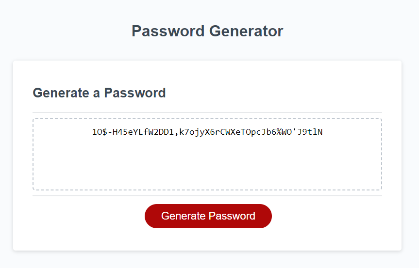

# README - Password Generator

Birmingham coding bootcamp week three challenge was to create a password generator.

## Description

The password generator needed to accept the following inputs. Password length (8-128 chars), lower case, upper case, numeric, special character types or some combination. It also needed to handle bad input ie a letter instead of a number etc.

Resizing needed to be responsive and should show on various size viewports.

## Installation

N/A

## Usage

Navigate to https://josephrbedford.github.io/passgen/ to use the password generator.

## Credits

Various Google sources and tutorials on array and string manipulation.

## License

Please refer to the LICENSE in the repo.

## Screenshot

